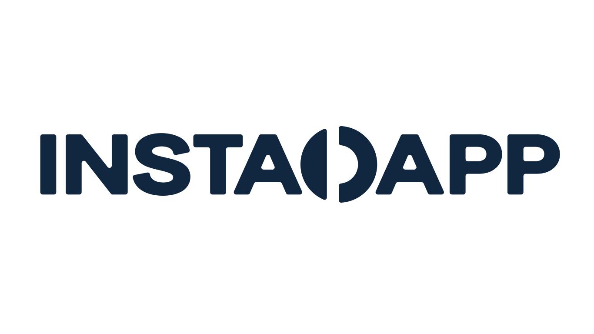
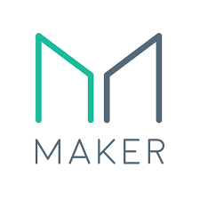
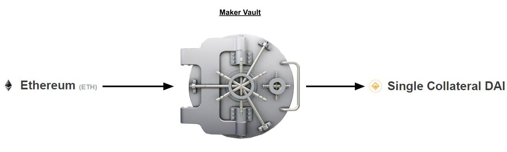
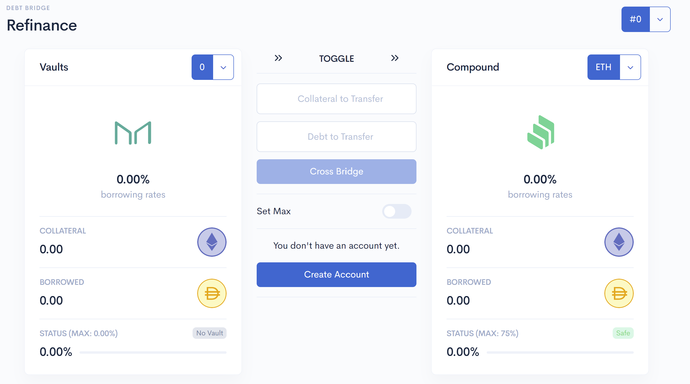
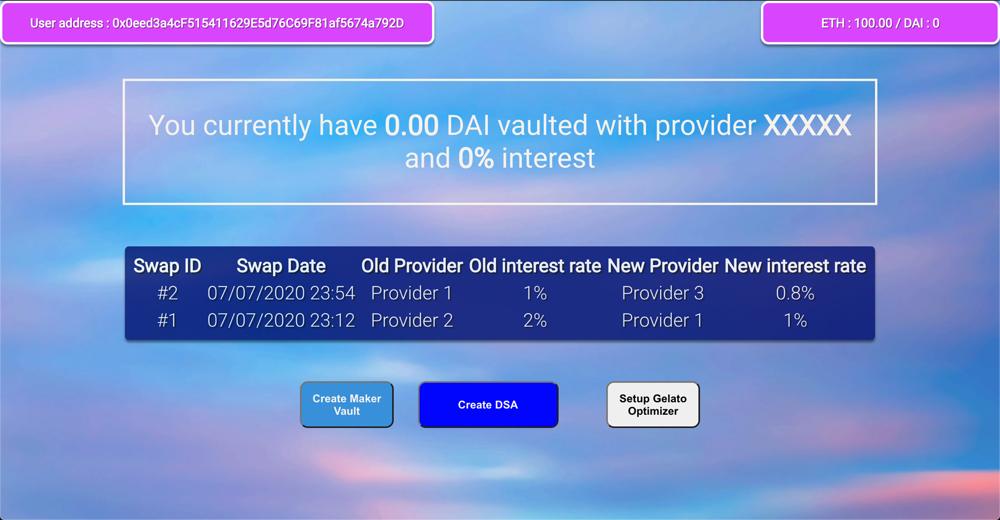

# Gelato Debt Bridge

    
    
    
    

This repo contains smart contract prototypes and mocks and a test suite showcasing how the InstaDapp DSA could use Gelato to automate the execution (or casting) of its Spells (connectors) based on arbitrary Conditions.

## Lending Bridge

The first iteration, written by Gelato [here](https://github.com/gelatodigital/gelato-instadapp), started with a simple spell, **Move DAI lending from DSR to Compound**, explained [here](/LendingBridgeExample.md).

## Debt Bridge

The second iteration, written for the ChainLink hackathon 2020, implements a **Debt Bridge**, composed of an [interface](https://github.com/oscarwroche/gelato-debt-bridge-frontend) composed with React, and an SDK to interact with InstaDapp and Gelato. This Repo contains the SDK and the relevant Smart Contract and tests.

### What is a Debt Bridge
[Maker](https://makerdao.com/en/) and [Compound](https://compound.finance/) are two financial services that allow a user to deposit ETH as a collateral and borrow another token up to a certain ratio (66% for ETHDAI).

    

For example, if the ETHDAI price is 300, and I deposit 10ETH in a Maker Vault, I can borrow 300 x 10 x 0.666 = 2000 DAI. This costs a yearly rate.
Now if Compound offers a better rate for the same financial product, I might want to move my borrow position to a Compound vault.

A **Debt Bridge** uses a [Gelato Automation](https://gelato.network/) to **automatically refinance a Maker Vault to a Compound position (and vice versa), depending which is the most profitable for the user**.

This reuses two existing deployed InstaDapp Connectors (ConnectMaker and ConnectCompound) to provision Gelato with a refinancing sequence, that would only be triggered if one is better than the other.

The refinancing sequence is the folowing:
- Instapool: borrow DAI
- MakerDAO: payback DAI
- MakerDAO: withdraw ETH
- Compound: deposit ETH
- Compound: borrow DAI
- Instapool: return DAI

An interface for that can be found [here](https://dsa.instadapp.io/recipe/refinance)

    

The difference is that thanks to Gelato, someone deploying a vault from our interface wouldn't need to refinance manually, as **Gelato executors will trigger the call when the conditions are met**.

### Testing
The following contracts were added to showcase the automation of the Spell:

- `MockInstaMakerResolver.sol` and `MockInstaCompoundResolver.sol`: to normalize CDAI.supplyRatePerBlock and dsr values to a _per second rate in 10\*\*27 precision_

This uses contracts deployed by Gelato and whitelisted by InstaDapp:

- `ConditionCompareUintsFromTwoSource`: a generic Gelato Condition that allows you to read and compare data from 2 arbitrary on-chain sources (returndata expected to be uint256 and normalized => hence MockInstaMakerResolver and MockInstaCompoundResolver). This Condition was used to compare DSR to CDAI rates and in the test suite we showcase how a change in the CDAI rate (it going above the DSR) can trigger an automatic rebalancing from MockInstaMakerResolver to MockInstaCompoundResolver via DSA Connectors.

- `ProviderModuleDSA`: this is needed for any Gelato integration. It tells Gelato how the execution payload should be formatted. 

- `ConnectGelato`: (now whitelisted by instaDapp and deployed on the mainnet) this is a Connector needed for the DSA to be able to submit Tasks to Gelato.

To see what's going on in the back check out the [contracts](./contracts) folder and make sure to check out `2_mv-Debt-Maker-Compound.test.js`, to see an end-to-end test showcasing the prototype. To do so follow the steps below:

1. Clone this repo
2. Put your INFURA_ID and INFURA_PRIVATE_KEY in .env
3. yarn install
4. npm run build
5. npm run test

### SDK
This repository exports an sdk used by the app that will allow the user to execute the following actions with MetaMask:
- create an InstaDapp DSA
- open a Maker vault (and borrow dai)
- create a Gelato setup for automatic refinancing

#### Front End

    

## Upcoming features

### Connect to onChain connectors for Compound and Maker

### Flash Loan
*Allows to refinance without liquidity*
- instaPool Flash Loan
- Aave Flash Loan

### Other lending services
*The more the merrier*
- Aave
- Use a condition contract for more than 2 financial services
